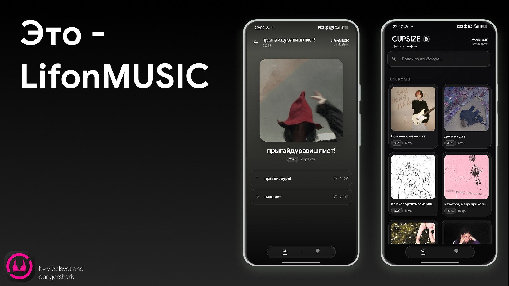
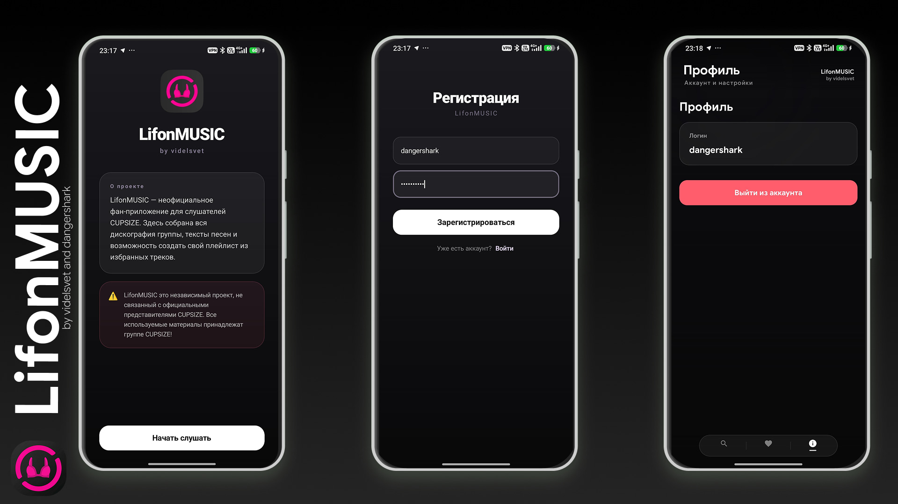
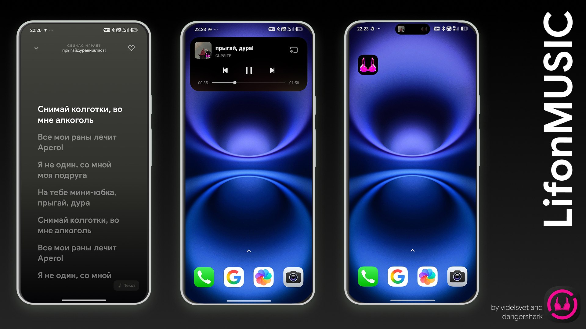

<!-- Language switcher -->

**[🇷🇺 Русский](#русский) | [🇬🇧 English](#english)**

---

# 🎵 LifonMUSIC

### Фан-приложение для слушателей CUPSIZE

*by videlsvet and dangershark*

## Что такое LifonMUSIC?

**LifonMUSIC** — это бесплатное неофициальное фан-приложение для Android, которое позволяет слушать все треки CUPSIZE — без ограничений, без рекламы и с полными текстами к каждой песне.

Приложение создано с любовью к сообществу группы: здесь собраны полная дискография, тексты песен и возможность создать свой плейлист из избранных треков.

> ⚠️ LifonMUSIC — это независимый проект, не связанный с официальными представителями CUPSIZE. Все используемые материалы принадлежат группе CUPSIZE.

---

## ✨ Возможности

- 🎧 **Полная дискография CUPSIZE** — все альбомы, все треки, бесплатно
- 📝 **Тексты песен** — слова к каждому треку, отображаются во время прослушивания
- ❤️ **Избранное** — сохраняй любимые треки
- 🔍 **Поиск по альбомам** — быстро найди нужное
- 👤 **Система аккаунтов** — зарегистрируйся и войди, для просмотра любимых песен и итогов года
- 🏝️ **Поддержка Dynamic Island** — информация о воспроизведении на поддерживаемых прошивках

---

## 📱 Поддержка Dynamic Island

LifonMUSIC поддерживает нативный Dynamic Island / анимированный остров на следующих прошивках:

| Бренд | Прошивка |
|---|---|
| Tecno | HOS |
| Xiaomi / Redmi / Poco | HyperOS 3 |
| OnePlus | OxygenOS, ColorOS |
| Oppo | ColorOS |
| Vivo | OriginOS |
| Infinix | XOS |

---

## 📸 Скриншоты

**Главные экраны — Альбом и Дискография**

**Онбординг, Регистрация и Профиль**

**Тексты, Dynamic Island и иконка приложения**

---

## 📲 Скачать

[**Releases**](../../releases/latest)

---

## 💬 Связь с нами

Следи за обновлениями, новостями и новыми треками в нашем Telegram-канале:

---

## 👥 Авторы

Сделано с ❤️ командой **videlsvet** и **dangershark**

| Роль | Автор | TikTok |
|---|---|---|
| 💻 Разработчик | videlsvet | [@wave66181](https://www.tiktok.com/@wave66181?_r=1&_t=ZS-94DvxyuzLYi) |
| 💡 Автор идеи | dangershark | [@dangeershark_t.t](https://www.tiktok.com/@dangeershark_t.t?_r=1&_t=ZS-94RK31XtDvQ) |

---
---

  
**English**

# 🎵 LifonMUSIC

### The fan app for CUPSIZE listeners

*by videlsvet and dangershark*

## What is LifonMUSIC?

**LifonMUSIC** is a free, unofficial fan app for Android that lets you listen to every CUPSIZE track — without limits, without ads, and with full lyrics for every song.

It's built with love for the band's community, bringing together the complete discography, synced lyrics, and a personal favorites playlist — all in one place.

> ⚠️ LifonMUSIC is an independent project not affiliated with the official representatives of CUPSIZE. All materials belong to the CUPSIZE group.

---

## ✨ Features

- 🎧 **Full CUPSIZE discography** — every album, every track, all free
- 📝 **Lyrics** — text for every song, displayed while you listen
- ❤️ **Favorites** — save the tracks you love
- 🔍 **Album search** — quickly find what you're looking for
- 👤 **Account system** — register and log in to view your favorite songs and year-end results
- 🏝️ **Dynamic Island support** — real-time playback info on supported firmware

---

## 📱 Dynamic Island Support

LifonMUSIC supports a native-style Dynamic Island / notification pill on the following Android firmware:

| Brand | Firmware |
|---|---|
| Tecno | HOS |
| Xiaomi / Redmi / Poco | HyperOS 3 |
| OnePlus | OxygenOS, ColorOS |
| Oppo | ColorOS |
| Vivo | OriginOS |
| Infinix | XOS |

---

## 📸 Screenshots

**Main screens — Album & Discography**

**Onboarding, Registration & Profile**

**Lyrics, Dynamic Island & App Icon**

---

## 📲 Download

[**Releases**](../../releases/latest)

---

## 💬 Stay in Touch

Follow updates, news, and new releases on our Telegram channel:

---

## 👥 Authors

Made with ❤️ by **videlsvet** and **dangershark**

| Role | Author | TikTok |
|---|---|---|
| 💻 Developer | videlsvet | [@wave66181](https://www.tiktok.com/@wave66181?_r=1&_t=ZS-94DvxyuzLYi) |
| 💡 Idea author | dangershark | [@dangeershark_t.t](https://www.tiktok.com/@dangeershark_t.t?_r=1&_t=ZS-94RK31XtDvQ) |

