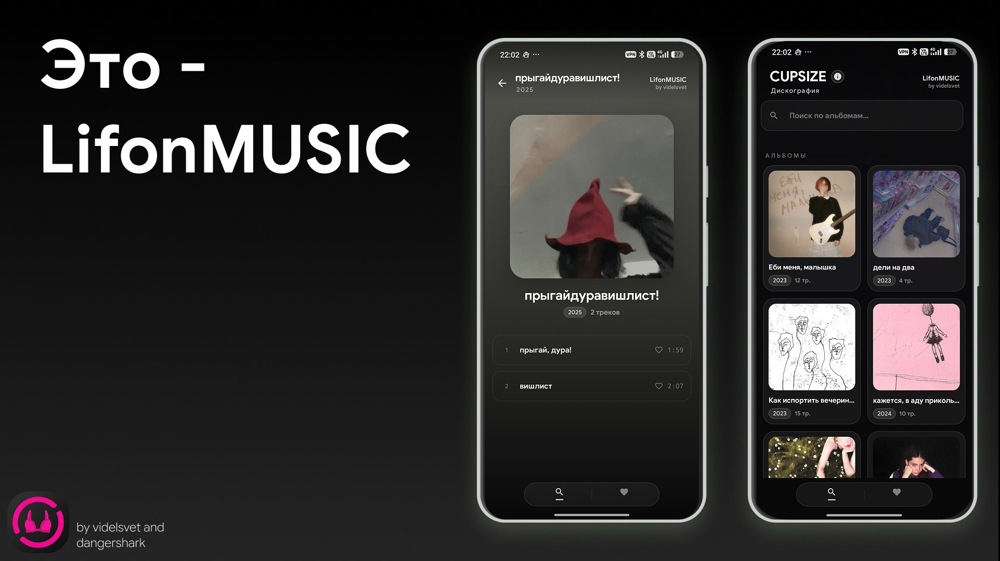
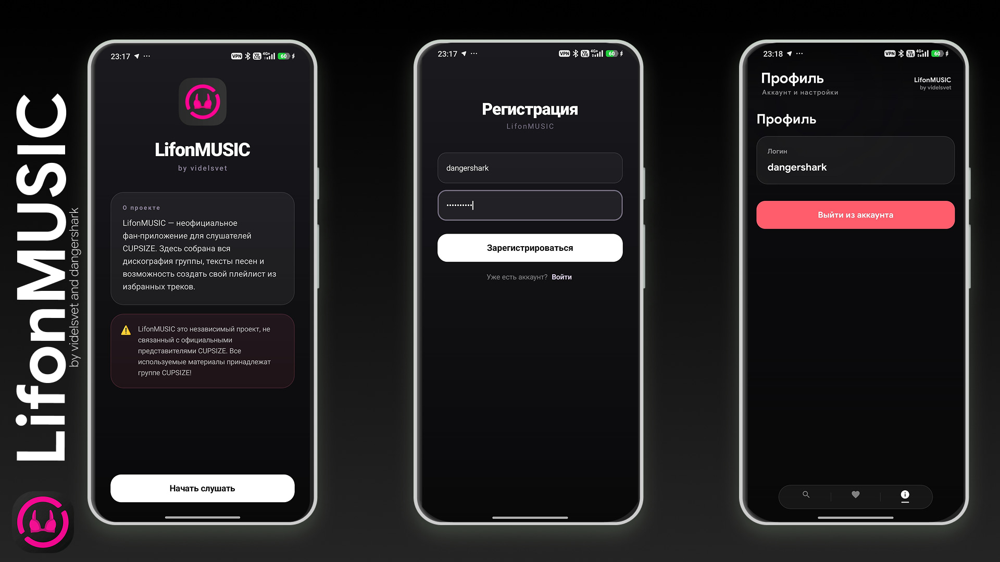
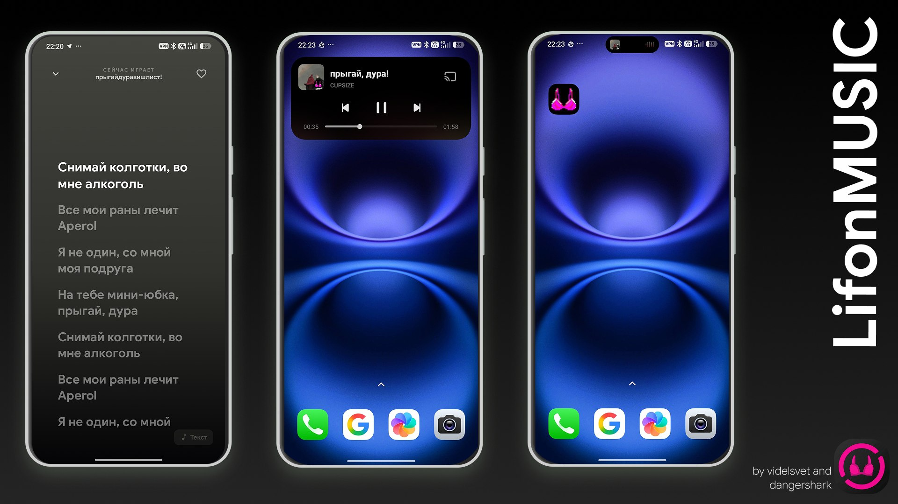

<!-- Language switcher -->

**[🇷🇺 Русский](#русский) | [🇬🇧 English](#english)**

---

### Фан-приложение для слушателей CUPSIZE

*by videlsvet, dangershark & qyrex*

 

## Что такое LifonMUSIC?

**LifonMUSIC** — это бесплатное неофициальное фан-приложение для Android, которое позволяет слушать все треки CUPSIZE — без ограничений, без рекламы и с полными текстами к каждой песне.

Приложение создано с любовью к сообществу группы: здесь собраны полная дискография, тексты песен и возможность создать свой плейлист из избранных треков.

> ⚠️ **Важно:** LifonMUSIC — независимый проект, не связанный с официальными представителями CUPSIZE. Все используемые материалы принадлежат группе CUPSIZE.

---

## ✨ Возможности

| | Функция | Описание |
|---|---|---|
| 🎧 | **Полная дискография** | Все альбомы и треки CUPSIZE — бесплатно, без ограничений |
| 📝 | **Тексты песен** | Слова к каждому треку, отображаются во время прослушивания |
| ❤️ | **Избранное** | Сохраняй любимые треки в личный список |
| 🔍 | **Поиск по альбомам** | Быстро найди нужное |
| 👤 | **Система аккаунтов** | Регистрация, вход, итоги года |
| 🏝️ | **Dynamic Island** | Информация о воспроизведении на поддерживаемых прошивках |

---

## 📱 Поддержка Dynamic Island

LifonMUSIC поддерживает нативный Dynamic Island / анимированный остров на следующих прошивках:

| Бренд | Прошивка |
|:---|:---|
| Tecno | `HOS` |
| Xiaomi / Redmi / Poco | `HyperOS 3` |
| OnePlus | `OxygenOS` · `ColorOS` |
| Oppo | `ColorOS` |
| Vivo | `OriginOS` |
| Infinix | `XOS` |

---

## 📸 Скриншоты

**Главные экраны — Альбом и Дискография**

**Онбординг, Регистрация и Профиль**

**Тексты, Dynamic Island и иконка приложения**

---

## 📲 Скачать

---

## 💬 Связь с нами

Следи за обновлениями, новостями и новыми треками в нашем Telegram-канале:

---

## 👥 Авторы

Сделано с ❤️ командой **videlsvet**, **dangershark** и **qyrex**

| Роль | Автор | Telegram |
|:---|:---|:---|
| 💡 Автор идеи | dangershark | [@dangeershark](https://t.me/dangershark) |
| 💻 Разработчик приложения | videlsvet | [@videlsvet](https://t.me/videlsvet) |
| 🌐 Разработчик сайта | qyrex | [@qyrex](https://t.me/qyrex) |

---
---

### The fan app for CUPSIZE listeners

*by videlsvet, dangershark & qyrex*

 

## What is LifonMUSIC?

**LifonMUSIC** is a free, unofficial fan app for Android that lets you listen to every CUPSIZE track — without limits, without ads, and with full lyrics for every song.

It's built with love for the band's community, bringing together the complete discography, synced lyrics, and a personal favorites playlist — all in one place.

> ⚠️ **Note:** LifonMUSIC is an independent project not affiliated with the official representatives of CUPSIZE. All materials belong to the CUPSIZE group.

---

## ✨ Features

| | Feature | Description |
|---|---|---|
| 🎧 | **Full discography** | Every CUPSIZE album and track — free, no limits |
| 📝 | **Lyrics** | Text for every song, displayed while you listen |
| ❤️ | **Favorites** | Save the tracks you love |
| 🔍 | **Album search** | Quickly find what you're looking for |
| 👤 | **Account system** | Register, log in, year-end results |
| 🏝️ | **Dynamic Island** | Real-time playback info on supported firmware |

---

## 📱 Dynamic Island Support

LifonMUSIC supports a native-style Dynamic Island / notification pill on the following Android firmware:

| Brand | Firmware |
|:---|:---|
| Tecno | `HOS` |
| Xiaomi / Redmi / Poco | `HyperOS 3` |
| OnePlus | `OxygenOS` · `ColorOS` |
| Oppo | `ColorOS` |
| Vivo | `OriginOS` |
| Infinix | `XOS` |

---

## 📸 Screenshots

**Main screens — Album & Discography**

**Onboarding, Registration & Profile**

**Lyrics, Dynamic Island & App Icon**

---

## 📲 Download

---

## 💬 Stay in Touch

Follow updates, news, and new releases on our Telegram channel:

---

## 👥 Authors

Made with ❤️ by **videlsvet**, **dangershark** and **qyrex**

| Роль | Автор | Telegram |
|:---|:---|:---|
| 💡 Idea author | dangershark | [@dangeershark](https://t.me/dangershark) |
| 💻 App Developer | videlsvet | [@videlsvet](https://t.me/videlsvet) |
| 🌐 Site Developer | qyrex | [@qyrex](https://t.me/qyrex) |
